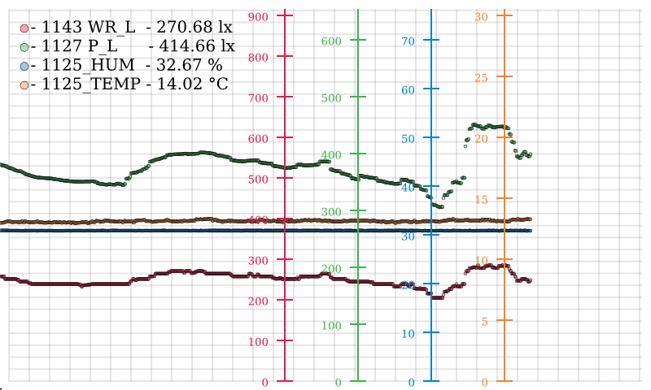

# garden-monitor-prototype
Prototype project to monitor garden environment

Dependencies:

- rpi2 headless image (OpenVG doesn't need an X-server)
- [openvg](https://github.com/ajstarks/openvg)
- [rpi-fbcp](https://github.com/tasanakorn/rpi-fbcp)
- [zlog (fork)](https://github.com/jonlamb-gh/zlog)
- [libphidget](https://www.phidgets.com/docs/Language_-_C#Quick_Downloads)

# GUI

