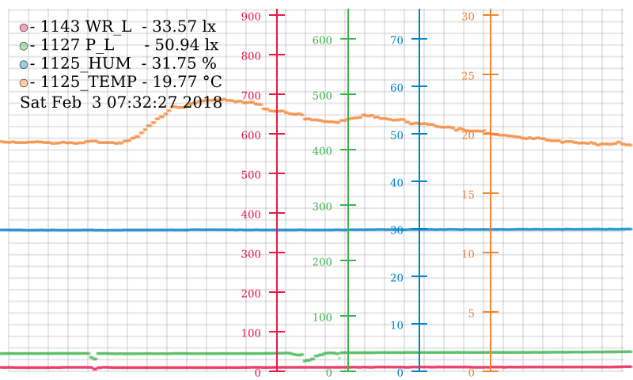

# garden-monitor-prototype
Prototype project to monitor garden environment

Dependencies:

- rpi2 headless image (OpenVG doesn't need an X-server)
- [openvg](https://github.com/ajstarks/openvg)
- [rpi-fbcp](https://github.com/tasanakorn/rpi-fbcp)
- [zlog (fork)](https://github.com/jonlamb-gh/zlog)
- [libphidget](https://www.phidgets.com/docs/Language_-_C#Quick_Downloads)

# Hardware

- Phidgets Interface Kit 8/8/8
- Phidgets 1143 - wide range light sensor
- Phidgets 1127 - precision light sensor
- Phidgets 1125 H/T - humidity/temperature sensor

# Usage

```
Usage: garden-monitor [OPTION...]
  -v, --verbose                                                     enable verbose output
  -s, --serial-number='Phidget serial number (0 means any)'         serial number of device to open
  -o, --log[='category name' default is 'gm']                       enable zlog CSV category logging
  -r, --screen-shot='file path'                                     on exit, write the current frame buffer to file (raw RGBA 32)
  -d, --data-poll-interval=1-N <milliseconds>, default = 500        data poll interval
  -g, --gui-redraw-interval=1-N <milliseconds>, default = 4,000     GUI redraw interval

Help options:
  -?, --help                                                        Show this help message
      --usage                                                       Display brief usage message
```

# GUI


